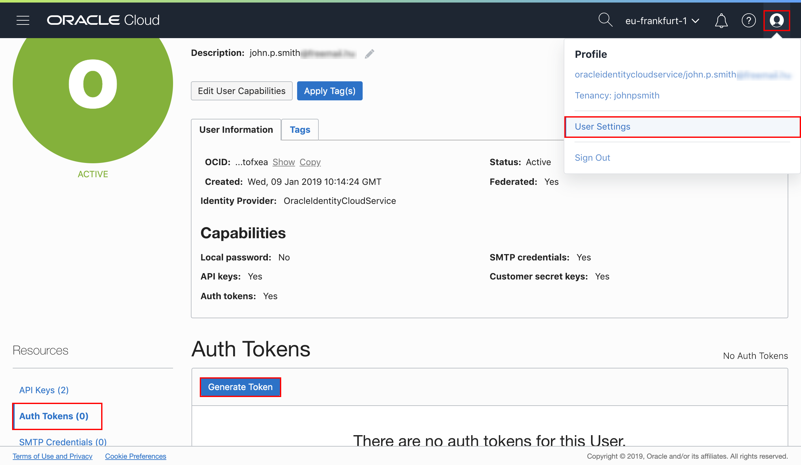
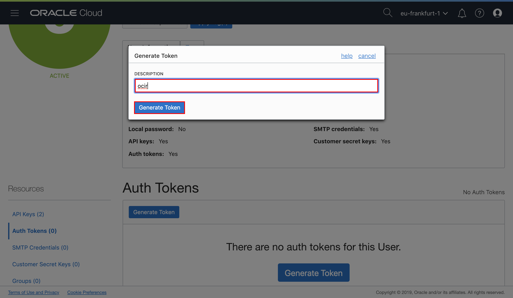
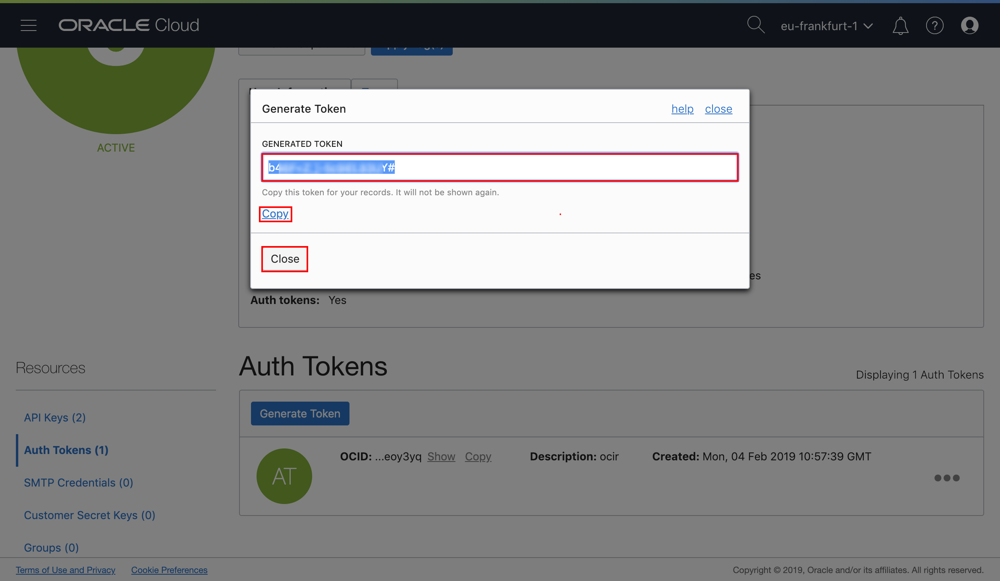
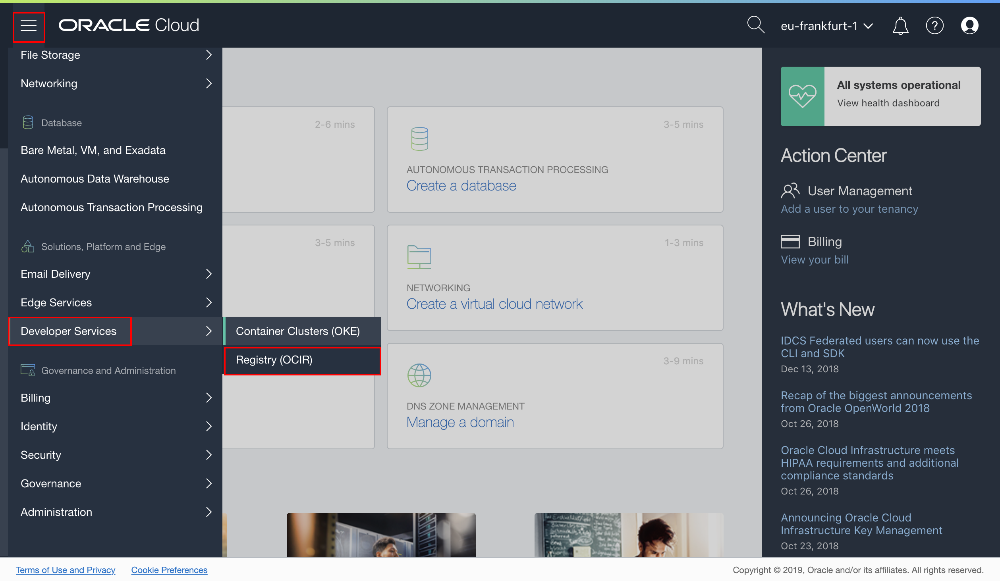
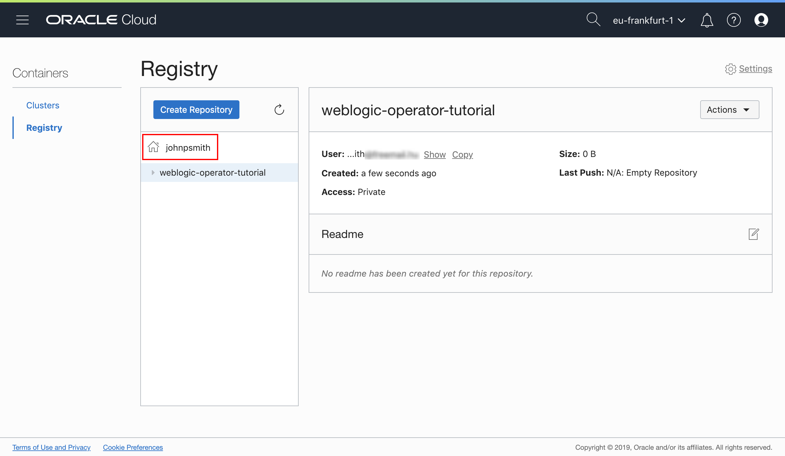
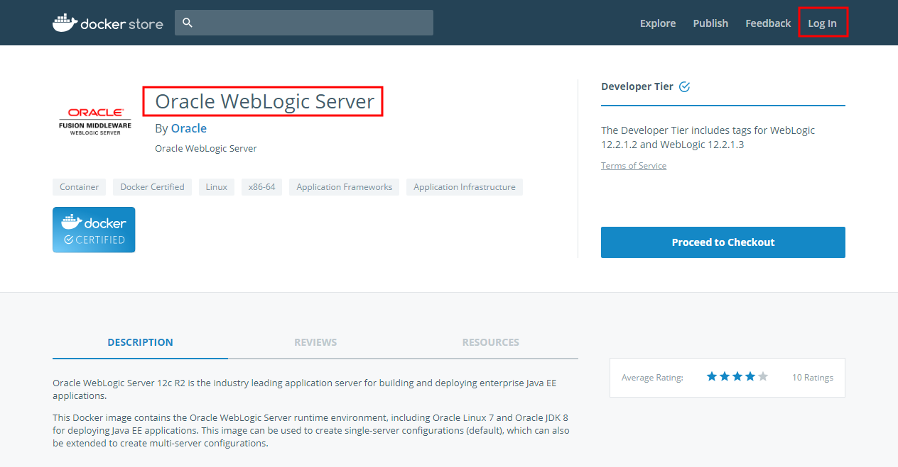
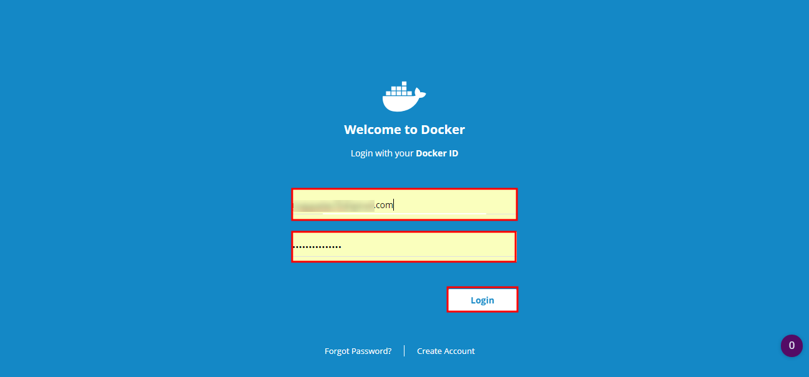
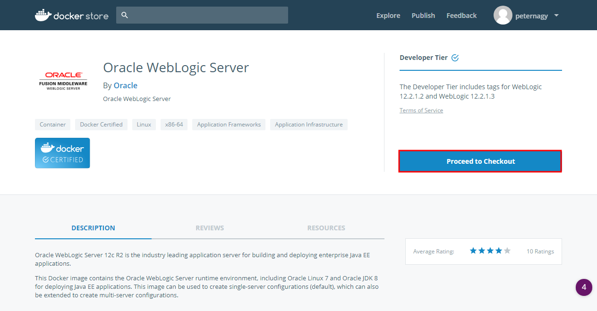
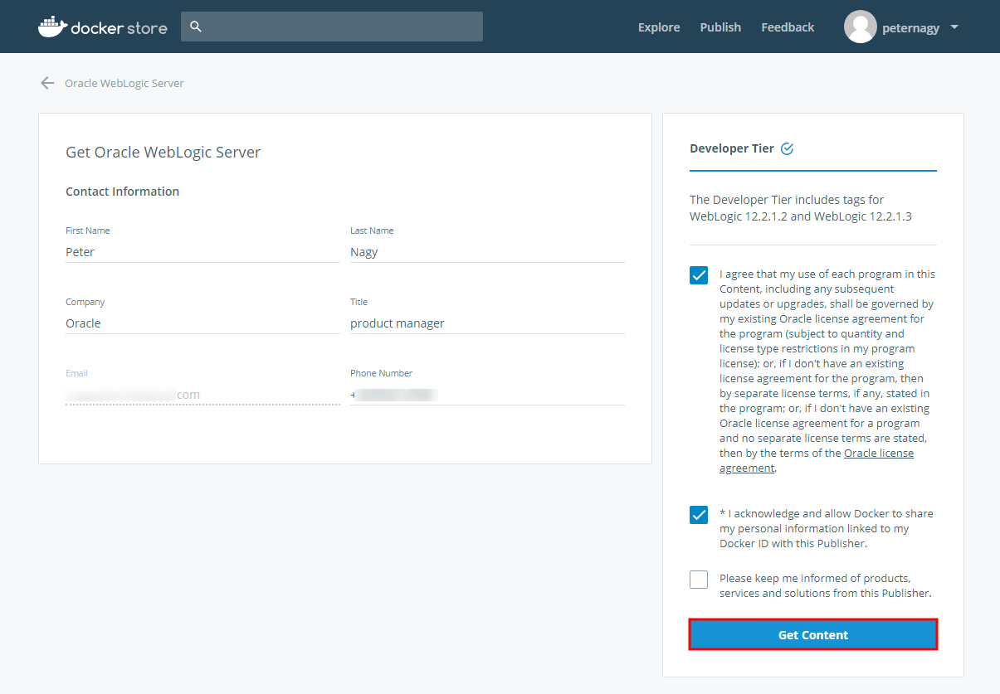
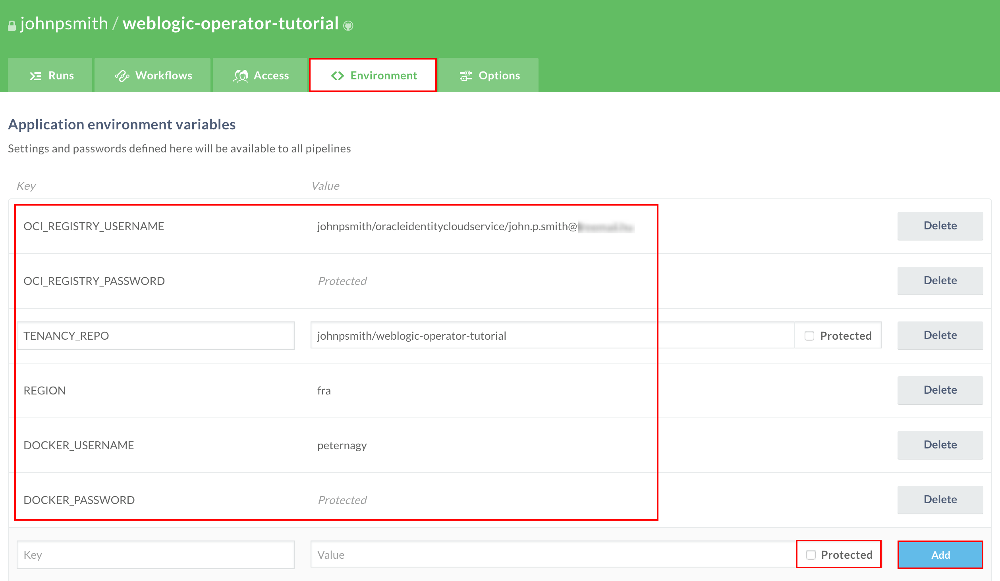

# Build and deploy demo application to WebLogic domain using Oracle Pipelines (Wercker) #

**Oracle Pipelines (Wercker)** is a Docker-Native CI/CD  Automation platform for Kubernetes & Microservice Deployments. Wercker is integrated with Docker containers, which package up application code and can be easily moved from server to server. Each build artifact can be a Docker container. The user can take the container from the Docker Hub or his private registry and build the code before shipping it. Its SaaS platform enables developers to test and deploy code often. They can push software updates incrementally as they are ready, rather than in bundled dumps. It makes it easier for coders to practice continuous integration, a software engineering practice in which each change a developer makes to the codebase is constantly tested in the process so that software doesn’t break when it goes live.

Oracle Pipelines is based on the concept of pipelines, which are automated workflows. Pipelines take pieces of code and automatically execute a series of steps upon that code.

This tutorial demonstrates how to create Oracle Pipelines application (CI/CD) to build custom and update WebLogic container image using official WebLogic image from Docker Store as base source.

The key components of Oracle Pipelines:

+ **Step** is self-contained bash script or compiled binary for accomplishing specific automation tasks.
+ **Pipelines** are a series of steps that are triggered on a git push or the completion of another pipeline.
+ **Workflows** are a set of chained and branched pipelines that allow you to form multi-stage, multi-branch complex CI/CD flows that take your project from code to production.
+ All pipelines execute inside a **Docker container** and every build artefact can be a Docker container.

### Prerequisites ###

- [Oracle Cloud Infrastructure](https://cloud.oracle.com/en_US/cloud-infrastructure) enabled account.
- Running Kubernetes cluster. You can use [Oracle Container Engine for Kubernetes (OKE)](setup.oke.md) cluster.
- Desktop with `kubectl` installed. `kubectl` has to be configured to access to the Kubernetes Cluster. In case of [OKE follow the tutorial](setup.oke.md) to configure `kubectl` access.

---

#### Prepare Oracle Container Registry access ####

Before you create your build pipeline you need to get your Oracle Container Registry token. Token acts as password to container registry provided by Oracle Cloud Infrastructure.

Open your OCI (Oracle Cloud Infrastructure) Console. If necessary Sign in again using your Cloud Services link you got in email during the registration process. Remember on the dashboard you need to click the menu icon at the top left corner and select **Compute** on the left sliding menu.

Using the OCI console page click the user icon and select **User Settings**. On the left area of the User details page select the **Auth Tokens** item. Click the **Generate Token** to get a new token.

Enter a description which allows you to easily identify the allocated token later. For example if you want to revoke then you have to find the proper token to delete. For example *ocir*.

Now copy and store(!) your generated token for later usage. Click **Close**.

Since you are on the User details page please note the proper user name for later usage. You need to use this user name in order to login to OCI Registry for push and pull images.

The second step is to create your image repository in container registry. At the end of the build process the pipeline will push the custom WebLogic image to this repository. When the image is available WebLogic Operator will pull the new (version of the) image from this repository. Using the left sliding menu select **Developer Services** and click **Registry**.

To create a new repository click **Create Repository**.

Define a repository name e.g. *weblogic-operator-test*. Leave the default *Private* settings and click **Submit**.

Review the newly created repository's detail. Please also note your registry's name (next to the house icon) for later usage. Basically it has to be your OCI tenancy's name.

#### Accept Licence Agreement to use `store/oracle/weblogic:12.2.1.3` image from Docker Store ####

If you have not used the base image [`store/oracle/weblogic:12.2.1.3`](https://store.docker.com/images/oracle-weblogic-server-12c) before, you will need to visit the [Docker Store web interface](https://store.docker.com/images/oracle-weblogic-server-12c) and accept the license agreement before the Docker Store will give you permission to pull that image.

Open [https://store.docker.com/images/oracle-weblogic-server-12c](https://store.docker.com/images/oracle-weblogic-server-12c) in a new browser and click **Log In**.

Enter your account details and click **Login**.

Click **Proceed to Checkout**.

Complete your contact information and accept agreements. Click **Get Content**.

Now you are ready to pull the  image on Docker enabled host after authenticating yourself in Docker Hub using your Docker Hub credentials.

#### Import WebLogic Operator Tutorial's source repository into your Github repository ####

In this step you will import the tutorial's source repository. The source repository contains the demo application deployed on top of WebLogic server, configuration yaml to quickly create Oracle Pipeline (CI/CD) application to build cutom WebLogic image and Kubernetes configuration files to deploy the WebLogic Operator and custom WebLogic image.

Sign in to [https://github.com](https://github.com) using your account and select **Import repository**.

Enter or copy the *https://github.com/nagypeter/weblogic-operator-tutorial.git* repository address into old repository's clone URL and choose a repository name e.g. *weblogic-operator-tutorial* for the new one. Leave the repository public. Click **Begin Import** and wait till the import is ready.

#### Create Oracle Pipelines Application to build custom WebLogic Docker container including demo application ####

First create your Oracle Pipelines application. Oracle Pipelines acts as continuous integration tool which will produce WebLogic container image and uploads to Oracle Container Registry.

The following pipelines are predefined in the Oracle Pipeline configuration file ([wercker.yml](https://github.com/nagypeter/weblogic-operator-tutorial/blob/master/wercker.yml)):

- **build**: Default and mandatory pipeline to start the workflow. It builds the demo Web Application using Maven.
- **build-domain-in-home-image**: Pipeline which runs Docker build to create custom WebLogic container image. First time when no *latest* image available in repository it uses official WebLogic image from Docker Store as base image and runs WLST script to customise the image. Also copies the demo Web Application into the image and deploys using WLST. Once *latest* (tag) of the image is available in the repository then the workflow just builds the Web Application and update the *latest* image with the new application binaries. After the Docker build the pipeline produces a new image and pushes to the image repository. Thus every time when changes happen in the sources and committed to Github. The image tag will be the commit hash tag of the source changes  which triggered the new build process. Also the historically latest gets the *latest* tag as well.

[Sign in to Oracle Pipelines (former Wercker)](https://app.wercker.com/) and click **Create your first application** button or the **+** icon at the top right corner and select *Add Application*.

NOTE! If you need to sign up to Oracle Pipelines do it with your Github account. Click the **LOG IN WITH GITHUB** button and authorise Oracle Pipelines application for your Github account. You can revoke Oracle Pipelines's authorisation request anytime using your Github's profile settings.

Select the owner of the application. By default it is your Oracle Pipelines username, but it can be any organization where you belong to. Make sure the selected SCM is *GitHub*. Click **Next**.

Select *weblogic-operator-tutorial* repository what you imported previously. Click **Next**.

Leave the default repository access without SSH key. Click **Next**.

If you want you can make your application public if you want to share the application's status otherwise leave the default private settings. Click **Create**.

The repository already contains a necessary `wercker.yml` but before the execution provide the following key/value pairs:

| Key            | Value                                                                     | Note for WebLogic on OKE                                                                                                                                         |
|----------------|---------------------------------------------------------------------------|------------------------------------------------------------------------------------------------------------------------------------------------------------------|
| OCI_REGISTRY_USERNAME | your_tenancy/your_cloud_username |  The username what you note during user settings. e.g. johnpsmith/oracleidentitycloudservice/john.p.smith@example.com |
| OCI_REGISTRY_PASSWORD | OCIR Auth Token | The Auth Token you generated previously |
| TENANCY_REPO | Container repository (including tenancy name!) | The repository name what you created few steps ahead e.g. johnpsmith/weblogic-operator-tutorial |
| REGION | The key of the home region. See the [documentation](https://docs.cloud.oracle.com/iaas/Content/Registry/Concepts/registryprerequisites.htm#Availab) to get your region key. | e.g. `fra` - stands for *eu-frankfurt-1* |
| DOCKER_USERNAME | Your Docker Hub username | Necessary to pull official WebLogic Server image from Docker Store |
| DOCKER_PASSWORD | Your Docker Hub password | Necessary to pull official WebLogic Server image from Docker Store |

To define these variables click **<>Environment** tab and enter keys and values. Remember that these values will be visible to anyone to whom you give access to the Oracle Pipeline application, therefore select **Protected** for any values that should remain hidden, including all passwords.

Click the **Worklflow** tab and then **Add new pipeline** to enable pipeline defined in *wercker.yml*.

Enter the name of the pipeline for example *build-domain-in-home-image*. Enter the exactly same name of the pipeline definition can be found in the *wercker.yml*. It is *build-domain-in-home-image*. Click **Create**.

Click again the **Worklflow** tab to get back to the editor page. Click the + sign after the mandatory *build* pipeline.

Leave the default branch(es) configuration and select the *build-domain-in-home-image* pipeline.

Your workflow should be similar:

Go to the **Runs** tab and click ***trigger a build now*** link.

To get more details about the current step click on the pipeline.

When the workflow is completed the WebLogic image is available in your image repository. Open the OCI console page and go to the container registry console to check.
