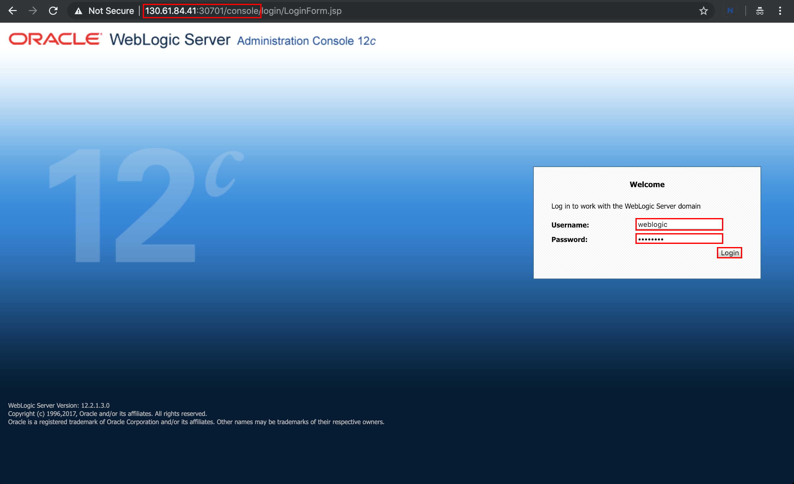

# Oracle Open World 2019 - HOL 5312 #

### Deploy WebLogic domain  ###

#### Preparing the Kubernetes cluster to run WebLogic domains ####

Create the domain namespace (again don't forget to replace proper text with USER ID given by instructor):
```
kubectl create namespace sample-domain1-ns-<PLEASE REPLACE THIS PART WITH YOUR USER ID>
```
Create a Kubernetes secret containing the Administration Server boot credentials. We do it to override credentials that are stored in the image. You may replace in the sample below password "welcome1" with any other but when you in the future try to login to console please don't forget which password you have used:
```
kubectl -n sample-domain1-ns-<PLEASE REPLACE THIS PART WITH YOUR USER ID> create secret generic sample-domain1-weblogic-credentials \
  --from-literal=username=weblogic \
  --from-literal=password=welcome1
```
Label the secret with domainUID:
```
kubectl label secret sample-domain1-weblogic-credentials \
  -n sample-domain1-ns-<PLEASE REPLACE THIS PART WITH YOUR USER ID> \
  weblogic.domainUID=sample-domain1 \
  weblogic.domainName=sample-domain1
```

#### Update WebLogic Operator configuration ####

Once you have your domain namespace (WebLogic domain not yet deployed) you have to update operator's configuration about the location where the domain will be deployed.

Make sure before execute domain `helm` install you are in the WebLogic Operator's local Git repository folder.
```
cd /u01/content/weblogic-kubernetes-operator/
```
To update operator execute the following `helm upgrade` command:
```
helm upgrade \
  --reuse-values \
  --set "domainNamespaces={sample-domain1-ns-<PLEASE REPLACE THIS PART WITH YOUR USER ID>}" \
  --wait \
  sample-weblogic-operator-<PLEASE REPLACE THIS PART WITH YOUR USER ID> \
  kubernetes/charts/weblogic-operator
```


#### Deploy WebLogic domain on Kubernetes ####

To deploy WebLogic domain you need to create a domain resource definition which contains the necessary parameters for the operator to start the WebLogic domain properly.

We provided for you domain.yaml file that contains yaml representation of the custom resoirce object. Please copy it locally
```
curl -LSs https://raw.githubusercontent.com/nagypeter/weblogic-operator-tutorial/master/k8s/domain_oow.yaml >/u01/domain.yaml
```
Please open it with your favorite editor and replace the fragment of "PLEASE REPLACE THIS PART WITH YOUR USER ID" with your USER ID.

Cerate Domain custom resource object by applying the following command:
```
kubectl apply -f /u01/domain.yaml
```
Check the introspector job which needs to be run first:
```
$ kubectl get pod -n sample-domain1-ns-<PLEASE REPLACE THIS PART WITH YOUR USER ID>
NAME                                         READY     STATUS              RESTARTS   AGE
sample-domain1-introspect-domain-job-kcn4n   0/1       ContainerCreating   0          7s
```
Check periodically the pods in the domain namespace and soon you will see the servers are starting:
```
$ kubectl get po -n sample-domain1-ns-<PLEASE REPLACE THIS PART WITH YOUR USER ID> -o wide
NAME                             READY     STATUS    RESTARTS   AGE       IP            NODE            NOMINATED NODE
sample-domain1-admin-server      1/1       Running   0          2m        10.244.2.10   130.61.84.41    <none>
sample-domain1-managed-server1   1/1       Running   0          1m        10.244.2.11   130.61.84.41    <none>
sample-domain1-managed-server2   0/1       Running   0          1m        10.244.1.4    130.61.52.240   <none>
```
You have to see three running pods similar to the result above. If you don't see all the running pods please wait and check periodically. The whole domain deployment may take up to 2-3 minutes.

In order to access any application or admin console deployed on WebLogic you have to configure *Traefik* ingress (we installed this in advance however you need to configure routing rules).

Below you configure path routing which will route the external traffic through *Traefik* to domain cluster address or admin server's console.

Execute the following ingress resource definition:
```
cat << EOF | kubectl apply -f -
apiVersion: extensions/v1beta1
kind: Ingress
metadata:
  name: traefik-pathrouting-1
  namespace: sample-domain1-ns-<PLEASE REPLACE THIS PART WITH YOUR USER ID>
  annotations:
    kubernetes.io/ingress.class: traefik
spec:
  rules:
  - host: cluster<PLEASE REPLACE THIS PART WITH YOUR USER ID>.oow
    http:
      paths:
      - path: /
        backend:
          serviceName: sample-domain1-cluster-cluster-1
          servicePort: 8001
      - path: /console
        backend:
          serviceName: sample-domain1-admin-server
          servicePort: 7001          
EOF
```


Please note the two backends and the namespace, serviceName, servicePort definitions. The first backend is the domain cluster service to reach the application at the root context path. The second is for the admin console which is a different service.

We need to define entry in /etc/hosts file with proper virtual host name. To do so first you need collect IP assigned to Traefik service (Ingress type of LB) . Please execute the following command to get the public IP address:
```
$ kubectl describe svc traefik-operator --namespace traefik | grep Ingress | awk '{print $3}'
129.213.172.95
```

Please edit /etc/hosts
```
$ vi /etc/hosts
```

and add the following line
```
129.213.172.95  cluster<PLEASE REPLACE THIS PART WITH YOUR USER ID>.oow
```
where the first argument is the IP of Traefik service.

Then access console by typing:
`http://cluster<PLEASE REPLACE THIS PART WITH YOUR USER ID>.oow/console`


Enter admin user credentials (weblogic/welcome1) and click **Login**



!Please note in this use case the use of Administration Console is just for demo/test purposes because domain configuration persisted in pod which means after the restart the original values (baked into the image) will be used again. To override certain configuration parameters - to ensure image portability - follow the override part of this tutorial.

#### Test the demo Web Application ####

The URL pattern of the sample application is the following:

`http://cluster<PLEASE REPLACE THIS PART WITH YOUR USER ID>.oow/opdemo/?dsname=testDatasource`


Refresh the page and notice the hostname changes. It reflects the managed server's name which responds to the request. You should see the load balancing between the two managed servers.

