# Create Oracle Container Engine for Kubernetes (OKE) on Oracle Cloud Infrastructure (OCI) #

Oracle Cloud Infrastructure Container Engine for Kubernetes is a fully-managed, scalable, and highly available service that you can use to deploy your containerised applications to the cloud. Use Container Engine for Kubernetes (sometimes abbreviated to just OKE) when your development team wants to reliably build, deploy, and manage cloud-native applications. You specify the compute resources that your applications require, and Container Engine for Kubernetes provisions them on Oracle Cloud Infrastructure in an existing OCI tenancy.

### Prerequisites ###

[Oracle Cloud Infrastructure](https://cloud.oracle.com/en_US/cloud-infrastructure) enabled account.

To create Container Engine for Kubernetes (OKE) the following steps need to be completed:

- Create network resources (VCN, Subnets, Security lists, etc.)
- Create Cluster.
- Create NodePool.

This tutorial shows the simplest way the *Quick Start* feature creates and configures all the necessary resources for a 3 Kubernetes node cluster. All the nodes will be deployed in different Availability Domains to ensure high availability.

More information about OKE and custom cluster deployment:

- [Oracle Container Engine documentation](https://docs.cloud.oracle.com/iaas/Content/ContEng/Concepts/contengoverview.htm)

#### Open the OCI console ####

Sign in using your Cloud Services link you got in email during the registration process. (If this is the first time you have to change the generated first time password.)

Use the username and the password distributed by the instructor. Click **Sign In**.

Click the menu icon at the top left corner and select **Compute** on the left sliding menu.

You have to land on the OCI console page.

#### Create Policy ####

A service policy allows OKE to create resources in tenancy such as compute. An OKE resource policy or policies enables you to regulate which groups in your tenancy can do what with the OKE API.

Optionally create more resource policies if you want to regulate which groups can access different parts of the OKE service.

Open the navigation menu. Under **Identity**, click **Policies**.

Select on left hand side menu a "root" compartment for your account (see screenshot). A list of the policies in the compartment you're viewing is displayed. If you want to attach the policy to a compartment other than the one you're viewing, select the desired compartment from the list on the left. Click **Create Policy**.

Enter the following:

- **Name:** A unique name for the policy. The name must be unique across all policies in your tenancy. You cannot change this later.
- **Description:** A friendly description.
- **Policy Versioning:** Select **Keep Policy Current**. It ensures that the policy stays current with any future changes to the service's definitions of verbs and resources.
- **Statement:** A policy statement. It MUST be: `allow service OKE to manage all-resources in tenancy`
- **Tags:** Don't apply tags.

Click **Create**.

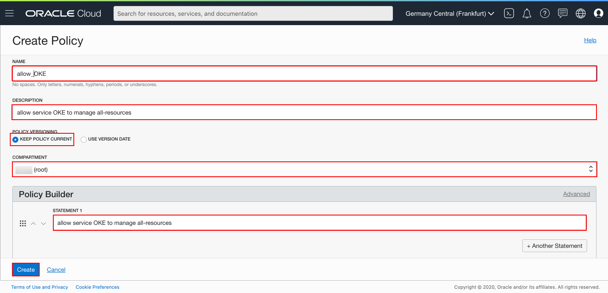

#### Create OKE (Oracle Container Engine for Kubernetes) cluster ####

*Quick Create* feature uses default settings to create a *quick cluster* with new network resources as required. This approach is the fastest way to create a new cluster. If you accept all the default values, you can create a new cluster in just a few clicks. New network resources for the cluster are created automatically, along with a node pool and three worker nodes.

In the Console, open the navigation menu. Under *Solutions, Platform and Edge*, go to *Developer Services* and click **Container Clusters (OKE)**.

On the Cluster List page, click **Create Cluster**.

In the Create Cluster Solution dialog, select *Quick Create* and click **Launch Workflow**.

Select **Quick Create** to create a new cluster with default settings, along with new network resources for the new cluster.
The Create Virtual Cloud Network panel shows the network resources that will be created for you by default, namely a VCN, two load balancer subnets, and three worker node subnets.

Specify the following configuration details on Cluster Creation page:
- **Name**: The name of the cluster. Leave the default value.
- **Compartment**: The name of the compartment. Leave the default value.
- **Kubernetes version**: The version of the Kubernetes. Leave the default value.
- **Choose Visibility Type**: Is the cluster going to be routable or not. Leave the default value.
- **Shape**: The shape to use for each node in the node pool. The shape determines the number of CPUs and the amount of memory allocated to each node. The list shows only those shapes available in your tenancy that are supported by Container Engine for Kubernetes. Select the available *VM.Standard2.1*
- **Number of nodes**: The number of worker nodes to create. Leave the default value *3*
- **Kubernetes Dashboard Enabled**: Leave the default true (DISABLED).
- **Tiller (Helm) Enabled**: Change the default true and make it ENABLED.

Click **Next** to review the details you entered for the new cluster.

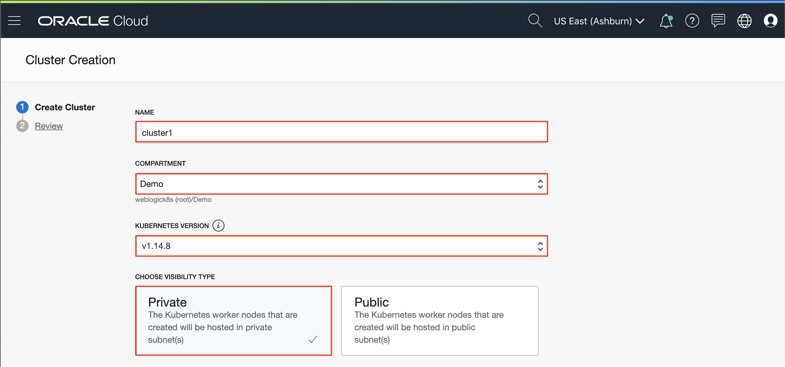
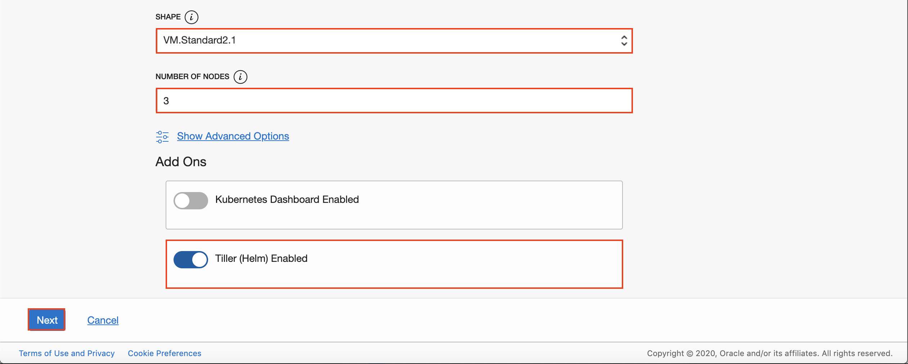

On the *Review* page, click **Submit** to create the new network resources and the new cluster.

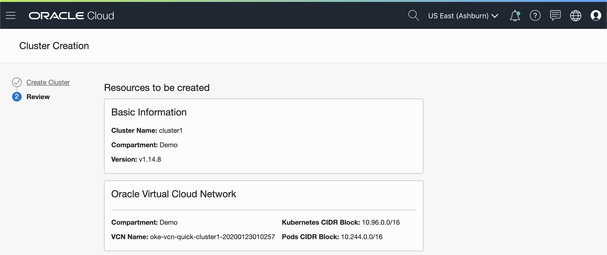
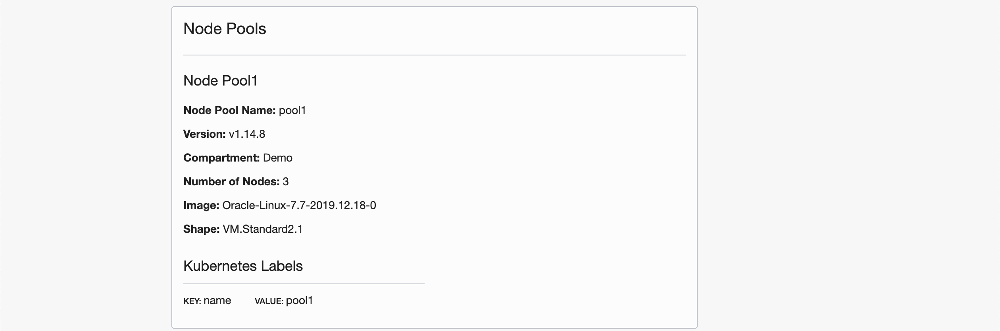
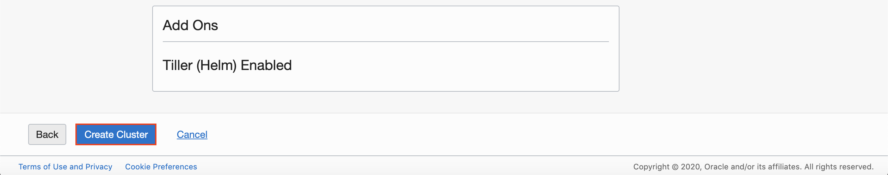

You see the different network resources being created for you.

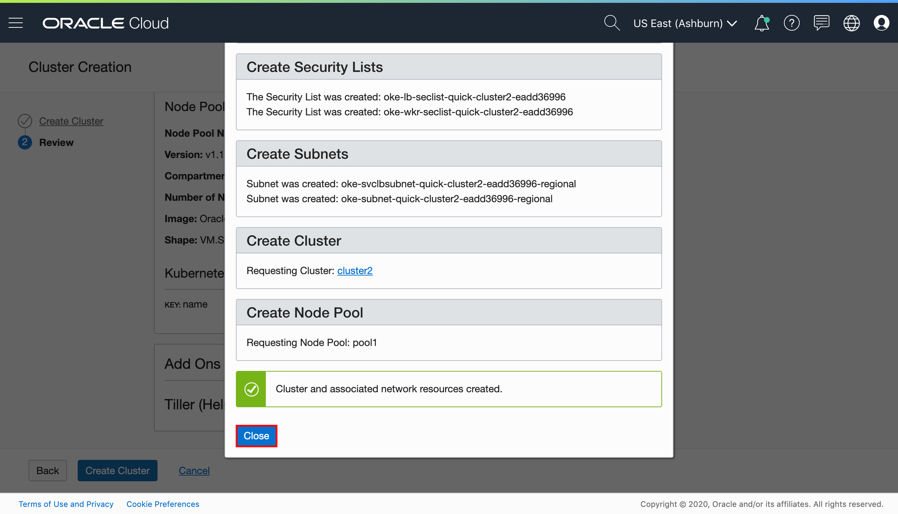

Click **Close** and the new cluster is shown on the *Cluster Details* page. When it has been created, the new cluster has a status of *Active*.

#### Prepare OCI CLI to download Kubernetes configuration file ####

When you create a cluster (you can see it as "Active" in the OCI dashboard), you need to download a Kubernetes configuration file (commonly known as a `kubeconfig` file) for the cluster. To do so you have to add OCI API Signing key and configure OCI CLI on your workstation (Virtualbox environment).

##### Configure OCI CLI #####

Before using the CLI, you have to create a config file that contains the required credentials for working with Oracle Cloud Infrastructure. To have this config the CLI walks you through the first-time setup process, step by step, use the oci setup config command. The command prompts you for the information required for the config file and the API public/private keys. The setup dialog generates an API key pair and creates the config file.

Before you start the setup collect the necessary information using your OCI console.

- User OCID
- Tenancy OCID
- Region

In the Console click on your OCI user name and select User Settings. On the user details page you can find the *user OCID*. Click **Copy** and paste temporary to a text editor.

To identify *tenancy OCID* in the Console, open the navigation menu. Under *Governance and Administration*, go to *Administration* and click **Tenancy Details**. Click **Copy** to get tenancy OCID on clipboard. Paste to your text editor for OCI CLI configuration.

Leave the console open during CLI configuration and copy the required information from the console page or from text editor where you collected the OCIDs (user and tenancy). When you want to accept the default value what is offered in square bracket just hit Enter.

---

Note: If you need to install OCI CLI then follow the [documentation](https://docs.cloud.oracle.com/iaas/Content/API/SDKDocs/cliinstall.htm).

---

Execute oci setup config command to setup the CLI:

	$ oci setup config
	    This command provides a walkthrough of creating a valid CLI config file.

	    The following links explain where to find the information required by this
	    script:

	    User OCID and Tenancy OCID:

	        https://docs.us-phoenix-1.oraclecloud.com/Content/API/Concepts/apisigningkey.htm#Other

	    Region:

	        https://docs.us-phoenix-1.oraclecloud.com/Content/General/Concepts/regions.htm

	    General config documentation:

	        https://docs.us-phoenix-1.oraclecloud.com/Content/API/Concepts/sdkconfig.htm

	Enter a location for your config [/home/oracle/.oci/config]:

Enter to accept default directory location. Provide your user and tenancy OCIDs.

	Enter a user OCID: <YOUR_USER_OCID>
	Enter a tenancy OCID: <YOUR_TENANCY_OCID>

Enter your region. You can see in the console (browser) at the top right area. It has to be *eu-frankfurt-1*, if not type the proper region code.

	Enter a region (e.g. eu-frankfurt-1, uk-london-1, us-ashburn-1, us-phoenix-1): <YOUR_REGION>

Generate new API signing key. For the location accept default. Don't use a passphrase for the private key.

	Do you want to generate a new RSA key pair? (If you decline you will be asked to supply the path to an existing key.) [Y/N]: Y

	Enter a directory for your keys to be created [/home/oracle/.oci]:
	Enter a name for your key [oci_api_key]:
	Public key written to: /home/oracle/.oci/oci_api_key_public.pem
	Enter a passphrase for your private key (empty for no passphrase):
	Private key written to: /home/oracle/.oci/oci_api_key.pem
	Fingerprint: 41:ea:cf:23:01:a2:bb:fb:84:79:34:8e:fe:bc:18:4f
	Config written to /home/oracle/.oci/config

##### Upload the public key of the API signing key pair #####

The final step to complete the CLI setup to upload your freshly generated public key through the console. The public key if you haven't changed it during setup can be found in the `/home/oracle/.oci/` directory and it's name `oci_api_key_public.pem`. Using your favourite way copy its content to the clipboard. While viewing user details click **Add Public Key**.

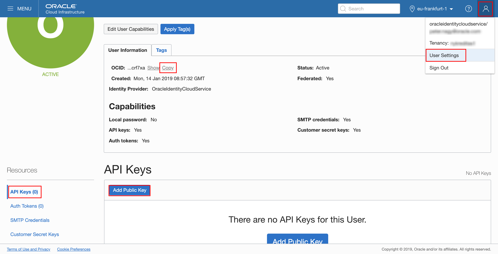

Copy the content of the `oci_api_key_public.pem` file into the *PUBLIC KEY* text area and click **Add**.

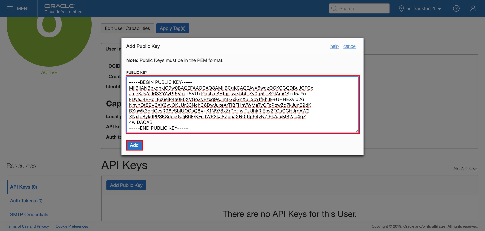

The key is uploaded and its fingerprint is displayed in the list.

##### Configure kubectl #####

---

Note: If you need to install `kubectl` then follow the [documentation](https://kubernetes.io/docs/tasks/tools/install-kubectl/).

---

The CLI setup now is done. To complete the `kubectl` configuration open the navigation menu and under **Developer Services**, click **Clusters**. Select your cluster and click to get the detail page.

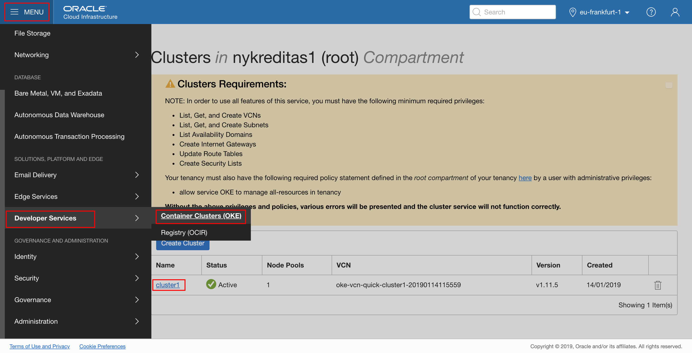

Click **Access Kubeconfig**.

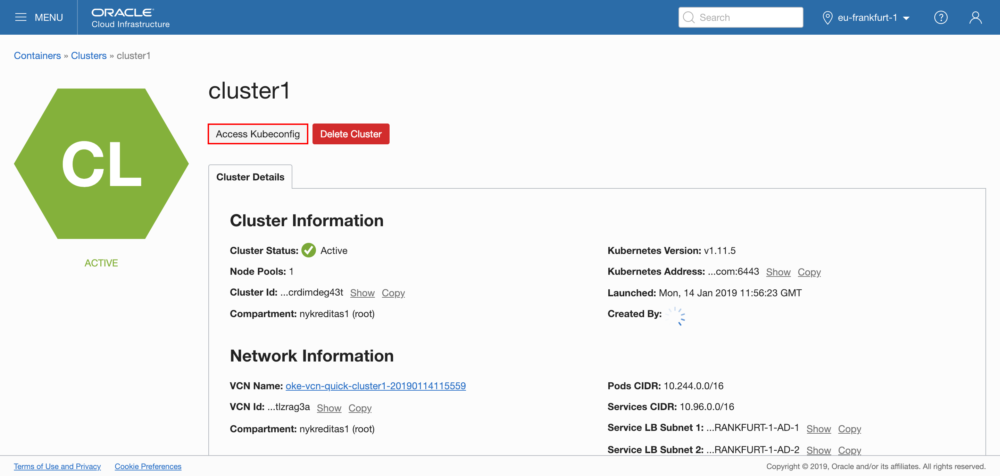

A dialog pops up which contains the customized OCI command that you need to execute to create Kubernetes configuration file.

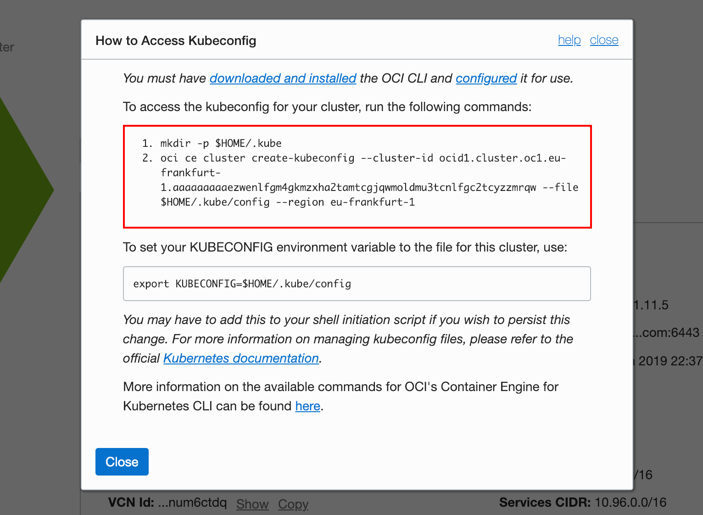

Copy and execute the commands on your desktop where OCI CLI was configured. For example:

	$ mkdir -p $HOME/.kube
	$ oci ce cluster create-kubeconfig --cluster-id ocid1.cluster.oc1.eu-frankfurt-1.THIS_EXAMPLE_DON'T_EXECUTE_THIS_COMMAND_======>_PLEASE_COPY_AND_PASTE_FROM_OCI_CONSOLE --file $HOME/.kube/config --region eu-frankfurt-1

Now check that `kubectl` is working, for example using the `get node` command:

	$ kubectl get node
	NAME            STATUS    ROLES     AGE       VERSION
	130.61.58.206   Ready     node      16m       v1.11.5
	130.61.60.127   Ready     node      16m       v1.11.5
	130.61.72.48    Ready     node      16m       v1.11.5

If you see the node's information the configuration was successful. Probably the Name column will contain the IPs that are non-routable

##### Set up the RBAC policy for the OKE cluster #####

In order to have permission to access the Kubernetes cluster, you need to authorize your OCI account as a cluster-admin on the OCI Container Engine for Kubernetes cluster. This will require your user OCID, which you used to configure OCI CLI few steps above. (This information available on the OCI console page, under your user settings.)

Then execute the role binding command using your(!) user OCID:

	kubectl create clusterrolebinding my-cluster-admin-binding --clusterrole=cluster-admin --user=<YOUR_USER_OCID>

For example:

	$ kubectl create clusterrolebinding my-cluster-admin-binding --clusterrole=cluster-admin --user=ocid1.user.oc1..AGAIN_THIS_IS_EXAMPLE
	clusterrolebinding "my-cluster-admin-binding" created

Congratulation, now your OCI OKE environment is ready to deploy your WebLogic domain.
