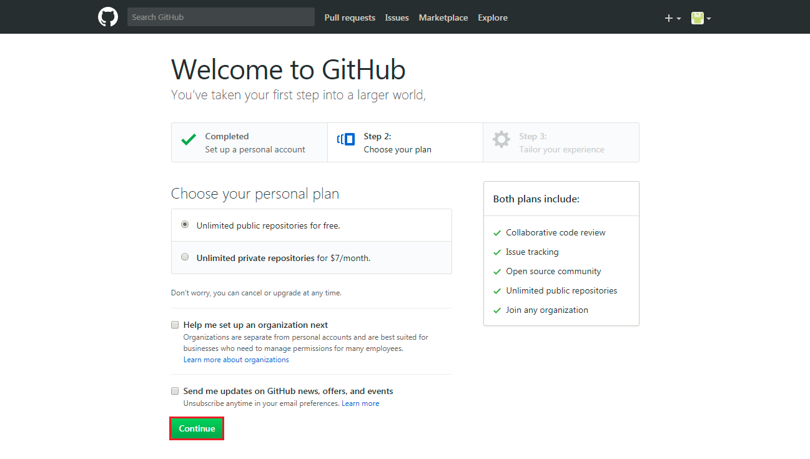

## Setting up an Account on GitHub.com ##

Go to [github.com](https://github.com) and set up an account and password there.

For the hands-on the public repositories are fine what available for free.

Click **Continue** and once the confirmation email arrives follow the instruction to enable your new GitHub.com account.
