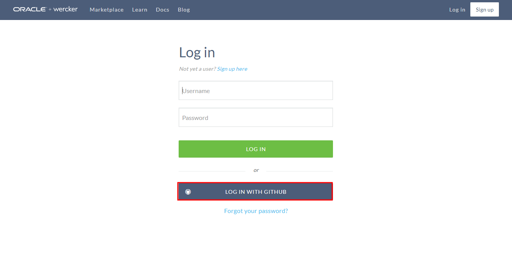
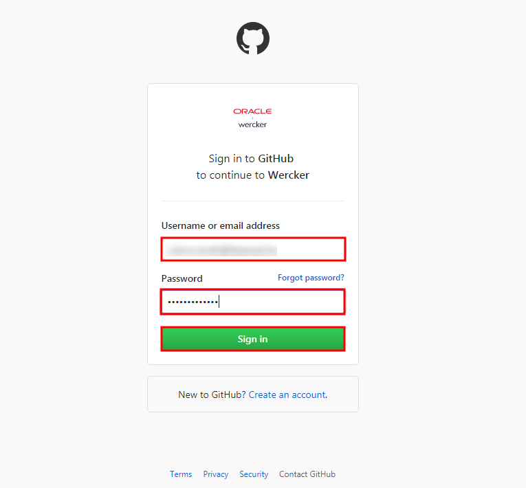
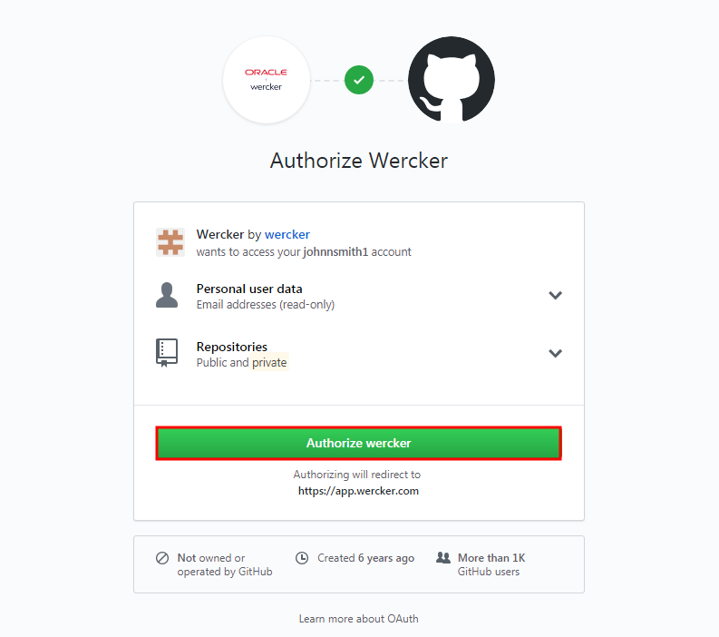
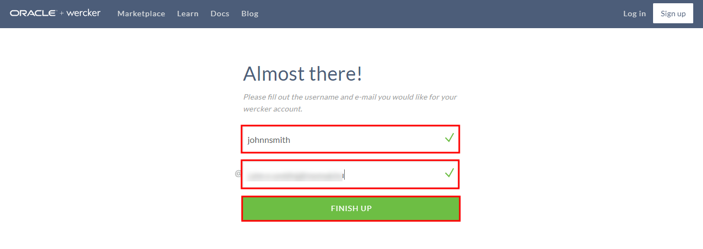
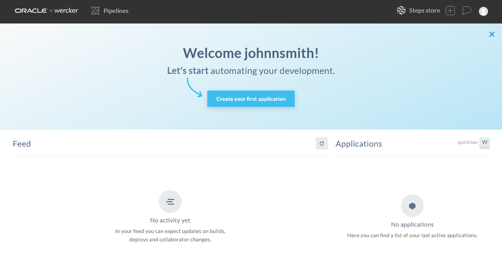

## Setting up an Account on GitHub.com ##

Go to [https://app.wercker.com](https://app.wercker.com) and set up an account and password there. Select **Log in using Github** option. This will enable Github account integration during the Oracle Pipelines (Wercker) account setup.

Enter your Github username and password. If you don't yet have then first [sign up for a Github account](sign.up.github.md). Click **Sign in**.

Enable authorization request from Oracle Pipelines (Wercker). Click **Authorize wercker**.

Choose an Oracle Pipelines (Wercker) username and enter your email address. Click **Finish up**.

Your Oracle Pipelines (Wercker) account now is ready to use.

