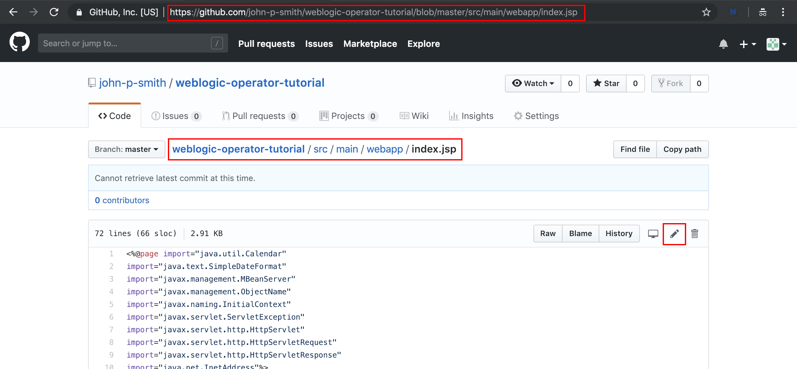
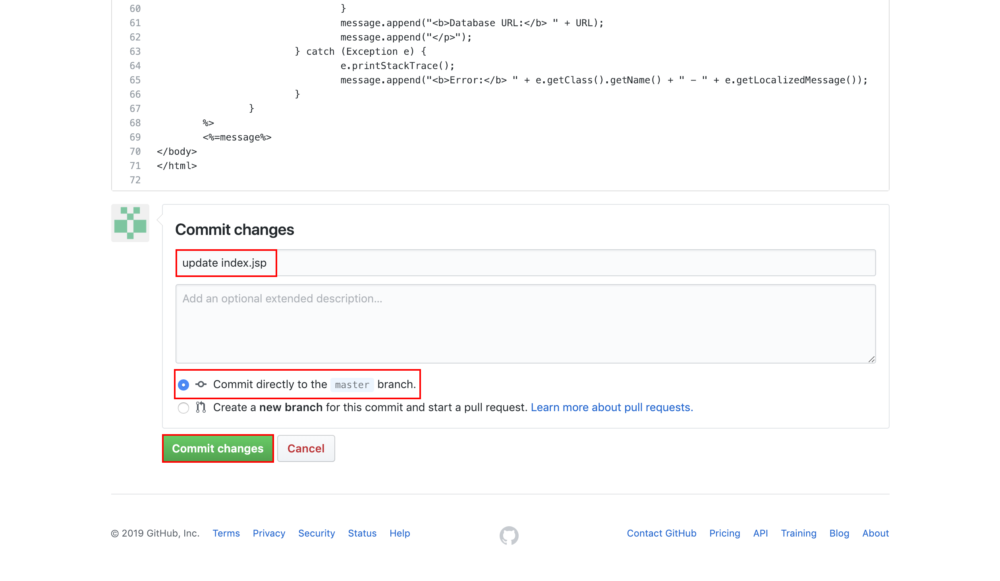
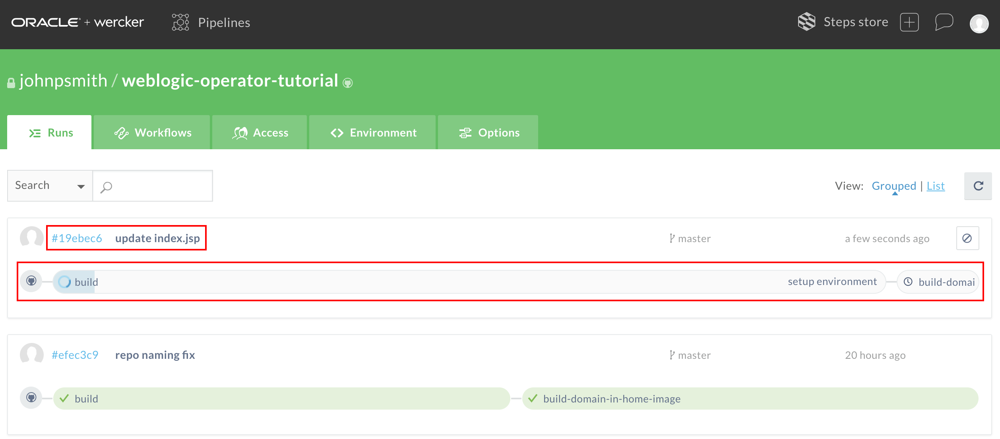
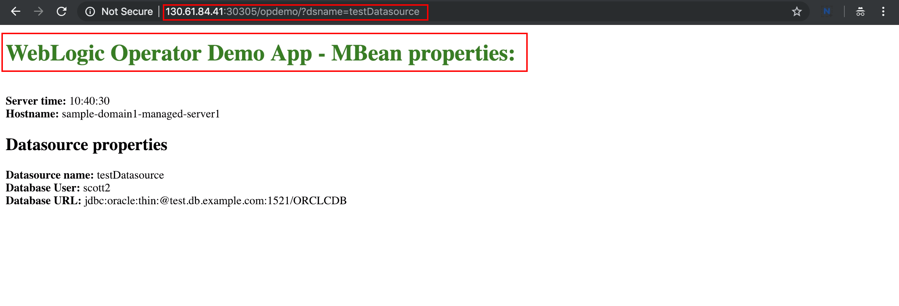

# Oracle WebLogic Operator Tutorial #

### Application Lifecycle Management ###

This tutorial implements the Docker image with the WebLogic domain inside the image deployment. This means all the artefacts including the deployed applications, domain related files are stored within the image. This results new WebLogic Docker image every time when the application modified. In this - widely adopted - approach the image is the packaging unit instead of the Web/Enterprise Application Archive (*war*, *ear*).

The preconfigured *build-domain-in-home-image* pipeline you defined to build the initial image also able to update *latest* version of image with the new web application archive. This approach isn't mandatory however can be a best practice to avoid long build time to run the same (WLST) domain configuration at every time when just the web application is modified.

Once the Oracle Pipelines application is ready and uploaded the new version of image you need to redeploy the new version of the image on Kubernetes. This can be done using [WebLogic Operator's server lifecycle management feature](https://github.com/oracle/weblogic-kubernetes-operator/blob/2.0/site/server-lifecycle.md). In this tutorial using operator you will initiate a domain restart when the new version of the image is available.

#### Modify the Web Application  ####

The easiest way to change the application to update the web application's main JSP directly in your github.com repository. Find the  
https://github.com/YOUR_GITHUB_USERNAME/weblogic-operator-tutorial/blob/master/src/main/webapp/index.jsp file and click **Edit**



Modify the header:
```
<h1>WebLogic Operator Demo App - MBean properties:</h1><br>
```
For example change the font colour:
```
<h1><font color="green">WebLogic Operator Demo App - MBean properties:</font></h1><br>
```
Enter a commit message leave the default *master branch* and click **Commit changes**



Now open again your Oracle Pipelines application to check the build which is triggered by the git commit. (Your direct URL has to be: https://app.wercker.com/YOUR_PIPELINES_USERNAME/weblogic-operator-tutorial/runs or just simply login again to https://app.wercker.com/)



During the build go back to your domain resource definition (*domain.yaml*) file and add the following entry to the `spec:` part. For example after the `serverStartPolicy: "IF_NEEDED"` line:
```
spec:
  [ ... ]
  serverStartPolicy: "IF_NEEDED"
  restartVersion: "applicationV2"
  [ ... ]
```

Don't forget the leading spaces to keep the proper indentation.

The `restartVersion` property lets you force the operator to restart servers. It's basically a user-specified string that gets added to new server pods (as a label) so that the operator can tell which servers need to be restarted. If the value is different, then the server pod is old and needs to be restarted. If the value matches, then the server pod has already been restarted.

Each time you want to restart some servers, you need to set `restartVersion` to a different string (the particular value doesn't matter). The operator will notice the new value and restart the affected servers.

When your image build is done and pushed to registry(!) apply the domain resource changes:
```
kubectl apply -f /u01/domain.yaml
```
You can immediately check the status of your servers/pods:
```
$ kubectl get po -n sample-domain1-ns
NAME                             READY     STATUS        RESTARTS   AGE
sample-domain1-admin-server      1/1       Terminating   0          22m
sample-domain1-managed-server1   1/1       Running       0          20m
sample-domain1-managed-server2   1/1       Running       0          21m
sample-domain1-managed-server3   1/1       Running       0          21m
```
The operator now performs a rolling server restart one by one. The first one is the *Admin* server than the *Managed* servers. There is a property called `maxUnavailable` on the domain resource which determines how many of the cluster's servers may be taken out of service at a time when doing a rolling restart. It can be specified at the domain and cluster levels and defaults to 1 (that is, by default, clustered servers are restarted one at a time).

During the rolling restart check your web application periodically. If the responding server already restarted then you have to see the change (green fonts) you made on the application. If the server is not yet restarted then it still serves the old version of the application.

`http://ANY_NODE_PUBLIC_IP_ADDRESS:30305/opdemo/?dsname=testDatasource`


